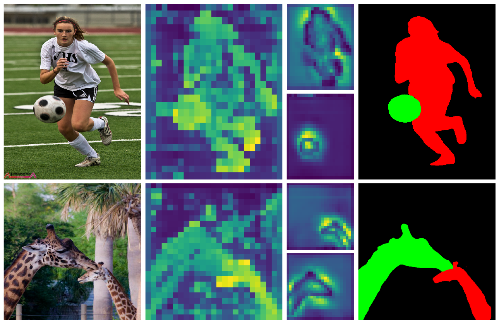

# Transformer-based Efficient Salient Instance Segmentation Networks with Orientative Query. TMM, 2022.

!
 
Official implementation of TMM2022 "Transformer-based Efficient Salient Instance Segmentation Networks with Orientative Query"

## Environment preparation

The code is tested on CUDA 10.1 and pytorch 1.6.0, specify the versions below to your desired ones.

```shell
conda create -n oqtr python=3.8 -y
conda activate oqtr
git clone https://github.com/ssecv/OQTR
cd OQTR
conda install -c pytorch torchvision
pip install -r requirements.txt
```

## Data preparation

Revise `build_sis` function in `datasets/coco.py`.

### Downroad the SIS10K dataset

- **SIS10K**
  - [Baidu Disk](https://pan.baidu.com/s/1ZOQAj0Lhg1K4Vi3eS5Tw6w) Verification code: hust
  - [Google Disk](https://drive.google.com/file/d/15MKRMWNe8OPteC4u1N-Y7d4kA3bqS5DN/view?usp=sharing) 
 
**Json files:** [Baidu](https://pan.baidu.com/s/1BUns3DJ_HnTC_Q_9gi4Npg ) Verification code: hust / [Google](https://drive.google.com/drive/folders/1mUf7r9GScw4L-9H9pSGkdC6x7WSf1bf9?usp=sharing)

## Run model

run demo

```shell
python visualize.py --input {INPUT_IMG} --output_dir {OUTPUT_DIR} --resume {WEIGHT_PATH}
```

- {INPUT_IMG} :input image path 
- {OUTPUT_DIR}: output path
- {WEIGHT_PATH}: model weights

run evaluation

```shell
python eval.py --no_aux_loss --masks --coco_path {PATH_TO_COCO} \
  --dataset_file sis --saliency_query --resume {WEIGHT_PATH}
```

Please replace {PATH_TO_COCO} with the dir of your coco-style dataset and {WEIGHT_PATH} for the model weights.

## Resources

- OQTR-R50
  - [standard](https://github.com/ssecv/OQTR/releases/download/v1.0.0/oqtr_r50_n20_ilso.pth)
  - [slim](https://github.com/ssecv/OQTR/releases/download/v1.0.0/oqtr_r50.pth)

## Citation
```BibTeX
@article{pei2022oqtr,
  title={Transformer-based Efficient Salient Instance Segmentation Networks with Orientative Query},
  author={Pei, Jialun and Cheng, Tianyang and Tang, He and Chen, Chuanbo},
  journal={IEEE Transactions on Multimedia},
  year={2022},
  publisher={IEEE}
}
```

## Acknowledge

The project is based on 
[DETR](https://github.com/facebookresearch/detr) and 
[CPD](https://github.com/wuzhe71/CPD), 
thanks them for their great work!
